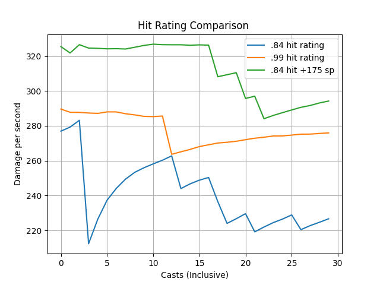

# Hit Rating Spellpower Comparison
The effects of hit rating and spellpower will be assessed and evaluated using the WoW 1.12 client (WoW Classic). We will of course be assessing these in a PvE raiding context.

## Background
A spellcaster will often want to do as much damage as they can, to the point of farming for the best gear, seeking the best enchants, purchasing increased spellpower potions, and acquiring World Buffs.
An item with an increased hit rating and/or spellpower permanently increases the caster's damage per second, but it often comes at a cost or a tradeoff.

While raiding a caster may come across a potential upgrade. To determine whether the item is a real upgrade the player needs to know the relative value of +hit, +crit, and +spellpower. For example, if a raider can choose between a +1 hit item and a +15 spellpower item, which should he or she choose?

## Baseline
Set a baseline understanding of the raider's decisions regarding gear.
### Hit rating is more rare than spellpower
Although this may be an obvious statement to many, it is important to understand in objective terms the role +hit and spellpower play for a caster, and the relative value and availability of each.
- Hit rating is rare in absolute terms
  - It is available for limited gear slots.
  - It is available in low doses, often in +1 or +2, and never more than +3, +hit.
  - The total number +hit gear is low, often only one or two items available per gear slot.
- Spellpower is readily available at level 60 for all spell-based classes.
  - It is available for every gear slot.
  - It is available in higher doses, often in 10+, and as much as up to 200+ for on use trinkets, per item slot.
  - There are a large variety of items per gear slot with +spellpower; players have a large selection of gear to choose from.

### Hit rating on gear is often more expensive than spellpower

It is worth evaulating the real cost to players for the differences explored in the previous section; how much is a player willing to pay for some *x* amount of hit or spellpower?

- Players will pay for more +hit than +spellpower in GDKP, DKP, and SR terms (in SR more players are likely to reserve +hit unless they already have it).
- Players will often prioritize +hit if they are not already close to hit cap (i.e., even if they don't pay more for it, they will acquire it first).
- For crafting, +hit gear is often at a premium compared to other similar items.

## Scenario

There are two players: Raider A and Raider B. Raider A has .99 hit rating and 400 spellpower, while Raider B has .84 hit rating. How much spellpower is needed for Raider B to do the same amount of damage as Raider A? 

        Hit   Spell
    A   .99   400
    B   .84   x

Formula = *(base spell + spc) * hit rating / seconds*

A is *(500 + (400 / 3.5 * 3)) * .99 / 3* = 278

B is *(500 + (575 / 3.5 * 3)) * .84 / 3* = 278

This answer is slightly misleading, which will be explained in the Simulations section below. In this scenario, Raider B will need 175+ additional spellpower, or a total of 575 spellpower, to match the damage of Raider A. If we take the difference of 175 spellpower and divide by the difference of hit, we get *12 = (575 - 400) / (99 - 84)*. This means about 12 spellpower will do the same damage of +1 hit.

        Hit   Spell
    A   .99   400
    B   .84   575

# Simulations

## Preface

Simulations are needed to capture the nuance of randomness, especially given the limited number of casts needed during a raid. For example, many boss fights in Molten Core, Blackwing Lair, and Ahn Qiraj only last one to two minutes, at most. This is enough time for only about thirty casts of Frostbolt or Shadowbolt.

Here we will create a simulator that determines whether a spell hit or is resisted, and if it hit the damage it did hit for. It will then plot a line that takes the average damage done per hit.

## Examples

### A Thousand Casts (50 minutes)
After 1,000 simulated casts the result was what was calculated above, or about 280 damage per second. Notice the spikes on the left of the graph; as the plot moves to the right the line (or damage) gradually starts to normalize.

Figure 1

### A Hundred Casts (5 minutes)

Running less simulated casts effectively creates a zoomed look of the data. The following is a simulation that ran only 100 times. The most consistent result was the ".99 hit rating with 400 spellpower", while ".84 hit rating with +575 spellpower" did more damage. It is worth noting that if this simulation is run enough times, in most cases the .99 hit rating will do more damage than either of the .84 hit options (as noted in the graph above).

Figure 2

### Thirty Casts (1 minute 30 seconds)

Figure 3

Figure 4
